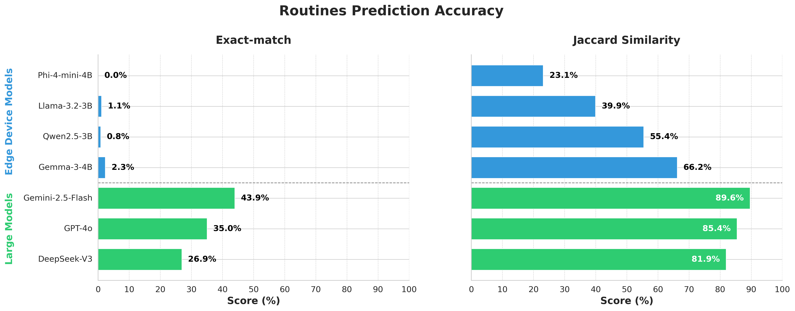
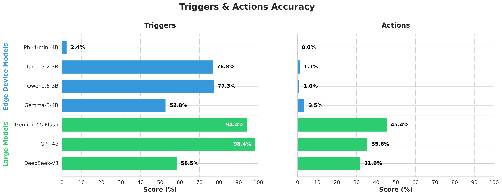

# 🏡 EdgeWisePersona: A Dataset for On-Device User Profiling from Natural Language Interactions

[](https://creativecommons.org/licenses/by/4.0/)

> A realistic, structured, and fully synthetic dataset designed to evaluate the ability of small language models to reconstruct user routines from natural language interaction sessions in smart home environments.

---

## 📋 Table of Contents

- [About the Project](#-about-the-project)
- [Dataset Overview](#-dataset-overview)
- [File Structure](#-file-structure)
- [Benchmark Task](#-benchmark-task)
- [Built With](#-built-with)
- [License](#-license)
- [Contact](#-contact)

---

## 🧠 About The Project

**EdgeWisePersona** is a synthetic dataset and benchmark created to support the development of compact, on-device language models for personalized smart home AI. Each user is modeled with a structured profile composed of routines, preferences, and a personality sketch. From these profiles, we generate realistic multi-turn dialogues using a large language model, simulating how users interact with smart home systems.

The benchmark task focuses on **routine reconstruction**: inferring structured user behaviors from unstructured natural language interaction histories. This setup supports evaluation of privacy-preserving, explainable, and resource-efficient models intended for edge-device deployment.

---

## 📁 Project Structure

The repository is structured around two main components:

- `definitions/`: Contains Pydantic class definitions for all dataset elements, including `Routine`, `Session`, `Trigger`, `DeviceState`, and `Character`. These provide a consistent and validated schema for loading, generating, and manipulating the dataset.

- `benchmark/`: Implements the benchmark logic for evaluating models on the routine reconstruction task. Includes utilities for running predictions, comparing outputs to ground truth, and computing evaluation metrics.

All source code is located under `src/edgewisepersona/`. The project is organized for modularity and ease of extension, supporting both dataset handling and benchmark evaluation.

The code used for data generation will be published soon to support full reproducibility.

---

## 📦 Dataset Access

The dataset is publicly available via the Hugging Face Hub:

🔗 [**EdgeWisePersona on Hugging Face**](https://huggingface.co/datasets/TCLResearchEurope/EdgeWisePersona)

You can download or browse the dataset directly through the platform, or load it programmatically using the `datasets` library:

```python
from datasets import load_dataset

dataset = load_dataset("TCLResearchEurope/EdgeWisePersona")
```

---

## 🗂 Dataset Overview

- ✅ 50 synthetic users with varied behaviors and personality traits  
- 💬 200 interaction sessions per user
- 🗣️ 10,000 multi-turn sessions in total
- 🔄 Mixture of routine-driven and spontaneous dialogues (75% vs. 25%)  
- 📄 Structured routine representations: triggers + actions  
- 🔍 Human-reviewed for coherence and alignment  
- 🧪 Benchmark setup with large model baselines for comparison

---

## 📁 File Structure

The dataset is distributed across three line-aligned `.jsonl` files:

- `characters.jsonl` – textual personality sketches and user traits, used to generate more natural and stylistically diverse dialogues.
- `routines.jsonl` – structured representations of user routines, each composed of contextual triggers and device actions.
- `sessions.jsonl` – generated multi-turn natural language dialogues, created under varying contextual conditions.

Each line in the three files corresponds to a single synthetic user.

---

## 🧪 Benchmark Task

The main evaluation task is **routine reconstruction**. Given a user's dialogue history, a model is expected to extract a set of behavioral routines reflecting the user’s preferences and contextual behaviors.

- Each model predicts routines.
- Predictions are evaluated against the ground-truth routines.
- Triggers and actions are evaluated separately to assess both high-level intent and precise behavioral understanding.

More details on the benchmark protocol can be found in the paper.

---

## 📊 Evaluation Results

The performance of several language models was evaluated on the routine reconstruction benchmark using two core metrics:

- Exact-match accuracy measures the proportion of routines that were predicted perfectly, reflecting a model’s ability to fully capture user behavior patterns.
- Jaccard similarity evaluates partial overlap between predicted and ground-truth routines, providing a more forgiving view of model understanding.



Additionally, we break down performance into Triggers and Actions, which captures how well models detect the context (Trigger) and the corresponding smart home response (Action).



Results reveal a significant performance gap between large foundation models and edge-deployable models, especially on exact-match accuracy and action inference. This highlights the current limitations of small models in understanding nuanced behavioral routines — and motivates future research on compact, personalized, on-device AI.

---

## 🛠 Built With

- [DeepSeek](https://github.com/deepseek-ai) – used for LLM-based session generation
- Python, JSONL, and lightweight review tooling

---

## 📄 License

This dataset is released under the [Creative Commons Attribution 4.0 International (CC BY 4.0)](https://creativecommons.org/licenses/by/4.0/) license. You are free to share and adapt the material for any purpose, provided that appropriate credit is given.

---

## 📜 Citation

```
@misc{bartkowiak2025edgewisepersonadatasetondeviceuser,
      title={EdgeWisePersona: A Dataset for On-Device User Profiling from Natural Language Interactions}, 
      author={Patryk Bartkowiak and Michal Podstawski},
      year={2025},
      eprint={2505.11417},
      archivePrefix={arXiv},
      primaryClass={cs.HC},
      url={https://arxiv.org/abs/2505.11417}, 
}
```

---

## 📬 Contact

For questions, suggestions, or collaborations:

[TCL Research Europe](https://tcl-research.pl/)
